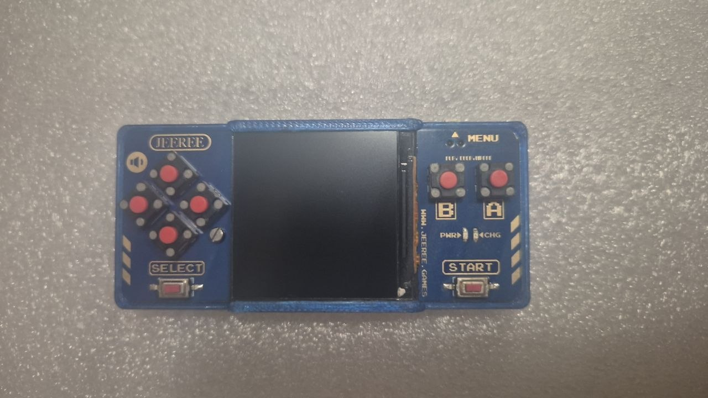

# NES Handheld Flasher

Неофициальная программа для Windows, которая позволяет делать резервную копию прошивки,
менять набор игр и восстанавливать прошивку на NES-совместимых мини-приставках на RP2040
(плата с маркировкой **JEEREE**, `www.jeree.games`).

*English summary: an unofficial Windows tool to back up the firmware, edit the game list and
restore the firmware of RP2040-based NES handhelds sold under the JEEREE name. It is not
affiliated with or endorsed by the manufacturer or Nintendo. The program contains no games or
firmware; you work only with data from your own device. See the Russian text below for
details.*



> Проект не связан с производителем приставки и с Nintendo. Названия и товарные знаки
> принадлежат их владельцам и используются только для описания совместимости.

## Что умеет программа

- **Резервная копия.** При первом запуске читает всю флеш-память приставки и сохраняет
  `backup.uf2` (полный образ, из него можно восстановить приставку) и `rp2040_dump.bin`.
- **Игры.** Показывает список игр из прошивки, позволяет добавлять (`.nes`), заменять,
  удалять, переименовывать, менять порядок, выгружать игру обратно в `.nes` и записывать
  изменения на приставку.
- **Чтение прошивки.** Повторное чтение прошивки в файл `rp2040_dump.bin`.
- **Восстановление из резервной копии.** Записывает `backup.uf2` обратно на приставку.
- **Проверки.** Предупреждает о PAL-играх, проверяет заголовок iNES, свободное место и целостность
  `backup.uf2`, не даёт писать без резервной копии.

## Совместимость

Программа проверялась только на одной приставке и только на Windows. Ваша приставка,
скорее всего, подходит, если:

- на плате есть надпись `JEEREE` и `www.jeree.games` (как на фото выше);
- кнопки Menu, Start, Select, A, B и крестовина расположены так же;
- в BOOTSEL она определяется как USB-диск RP2040 (на нём есть файл `INFO_UF2.TXT`).

Другие ревизии платы и другие приставки на RP2040 не проверялись. Если вы пробовали,
напишите в Issues.

Ограничения:

- Эмулятор приставки рассчитан на **NTSC**. PAL-игры будут работать быстрее (и музыка тоже).
  Программа помечает такие игры.
- ROM должны быть в формате **iNES**. Заголовок NES 2.0 при добавлении преобразуется в iNES 1;
  игры с mapper больше 255 не поддерживаются.
- В таблице помещается не больше 128 игр, и их суммарный размер ограничен свободным местом во флеше.
- Windows 10 и новее. Linux и macOS не проверялись.

## Установка

Скачайте архив `nes-handheld-flasher-<версия>-windows-x64.zip` на странице
[Releases](../../releases), распакуйте и запустите `flasher.exe`. Установка и драйверы не нужны.
Файлы `backup.uf2` и `rp2040_dump.bin` создаются рядом с программой, поэтому положите её в
отдельную папку, в которую у вас есть право писать.

Исполняемый файл не подписан цифровой подписью, поэтому Windows SmartScreen может показать
предупреждение о неизвестном издателе. Контрольную сумму SHA-256 можно сверить с файлом
`.sha256` на странице релиза.

## Как пользоваться

### Как перевести приставку в режим BOOTSEL

Все операции требуют режима BOOTSEL. Программа показывает эти шаги на каждом экране:

1. Выключите приставку долгим нажатием **Start**. Если она включена, войти в BOOTSEL не получится.
2. Подключите приставку к компьютеру по USB.
3. Нажмите и удерживайте **Menu**.
4. Удерживая Menu, нажмите **Start**.
5. Отпустите Menu, но **продолжайте удерживать Start**.

**Start работает как кнопка питания: не отпускайте его, пока программа не сообщит, что операция
завершена.** Если отпустить его во время записи, приставка выйдет из BOOTSEL посреди копирования.
В таком случае повторите операцию; если приставка не запускается, восстановите её из `backup.uf2`.

### Первый запуск: резервная копия

Если рядом с программой нет `backup.uf2` или `rp2040_dump.bin`, программа сразу открывает экран
резервной копии. Выполните шаги BOOTSEL и ждите: всё произойдёт автоматически. По окончании
программа перезагрузит приставку и откроет вкладку «Игры». **Сохраните `backup.uf2` в надёжном
месте: это ваш способ вернуть приставку в исходное состояние.** Файл никогда не перезаписывается.

### Редактирование списка игр

На вкладке «Игры» загрузите дамп (по умолчанию `rp2040_dump.bin`), измените список кнопками
справа (добавить, изменить, выгрузить в `.nes`, удалить, вверх, вниз) и нажмите
«Записать на приставку». Если в списке есть несохранённые изменения, программа предложит
сохранить прошивку в файл. Затем выполните шаги BOOTSEL: запись начнётся автоматически.
Запись затрагивает только таблицу игр и область ROM, код эмулятора и настройки не меняются.

### Восстановление

Вкладка «Восстановление из резервной копии» записывает `backup.uf2` на приставку целиком.
Это заменит всё содержимое флеш-памяти, включая настройки и сохранения. Программа проверит
файл и попросит подтверждения.

## Как это работает

- **Чтение.** Программа находит диск BOOTSEL (по файлу `INFO_UF2.TXT`) и копирует на него небольшой
  вспомогательный образ (пейлоад, встроен в `flasher.exe`). RP2040 загружает его в RAM и
  запускает; флеш-память при этом **не перезаписывается**. Пейлоад создаёт USB CDC-устройство и по
  простому протоколу с CRC отдаёт содержимое флеш-памяти блоками. После чтения приставка
  перезагружается. Описание протокола: [`docs/PROTOCOL.md`](docs/PROTOCOL.md).
- **Игры.** В прошивке есть таблица игр (адрес `0x64000`, записи по 32 байта: имя, адрес и размер)
  и образы ROM в формате iNES, упакованные подряд с адреса `0x65000`. Программа разбирает таблицу,
  показывает игры, а при записи заново собирает таблицу и область ROM.
- **Запись.** Изменённая область (таблица и ROM, выровненные по сектору) оборачивается в UF2 и
  копируется на диск BOOTSEL как `firmware.uf2`; загрузчик RP2040 прошивает её сам. Остальная
  флеш-память не затрагивается.
- **Восстановление.** `backup.uf2` содержит полный образ флеш-памяти и копируется тем же способом.

## Сборка из исходников

Нужен Rust (стабильный; нужная версия и цель `thumbv6m-none-eabi` подтянутся из
`rust-toolchain.toml` через `rustup`) и Git.

```
cargo build --release -p flasher
```

Готовый файл: `target\release\flasher.exe`. Сборка автоматически собирает пейлоад
(`rp2040-payload/`) и встраивает его в программу (`flasher/build.rs`). В отладочной сборке
(`cargo run`) остаётся окно консоли, в релизной его нет.

Проверки, как в CI:

```
cargo fmt --all --check
cargo clippy --workspace --all-targets -- -D warnings
cargo test --workspace
```

Для `rp2040-payload/` отдельно: `cargo fmt --check` и `cargo clippy -- -D warnings`
внутри этой папки.

Структура репозитория:

| Каталог | Назначение |
|---|---|
| `flasher/` | программа с интерфейсом (eframe/egui) |
| `protocol/` | общий `no_std`-протокол программы и пейлоада |
| `rp2040-payload/` | прошивка-пейлоад для RP2040 (отдельный проект) |
| `docs/` | документация протокола и изображения |

## Ответственность

Программа записывает данные во флеш-память устройства. Используйте её на свой риск и сохраняйте
`backup.uf2` до любых изменений. Программа не содержит игр или прошивки производителя; за
использование и распространение игр, образов и дампов отвечает пользователь.

## Участие ИИ

Большая часть кода, тестов, workflows и этого README написана совместно с ИИ-ассистентом
**Devin** (Cognition) под руководством автора: автор ставил задачи, проверял поведение на
реальной приставке и принимал решения, ассистент предлагал и писал код. Ответственность за проект
несёт автор.

## Лицензия

[MIT](LICENSE), Copyright (c) 2026 Aleksey Syryh.
